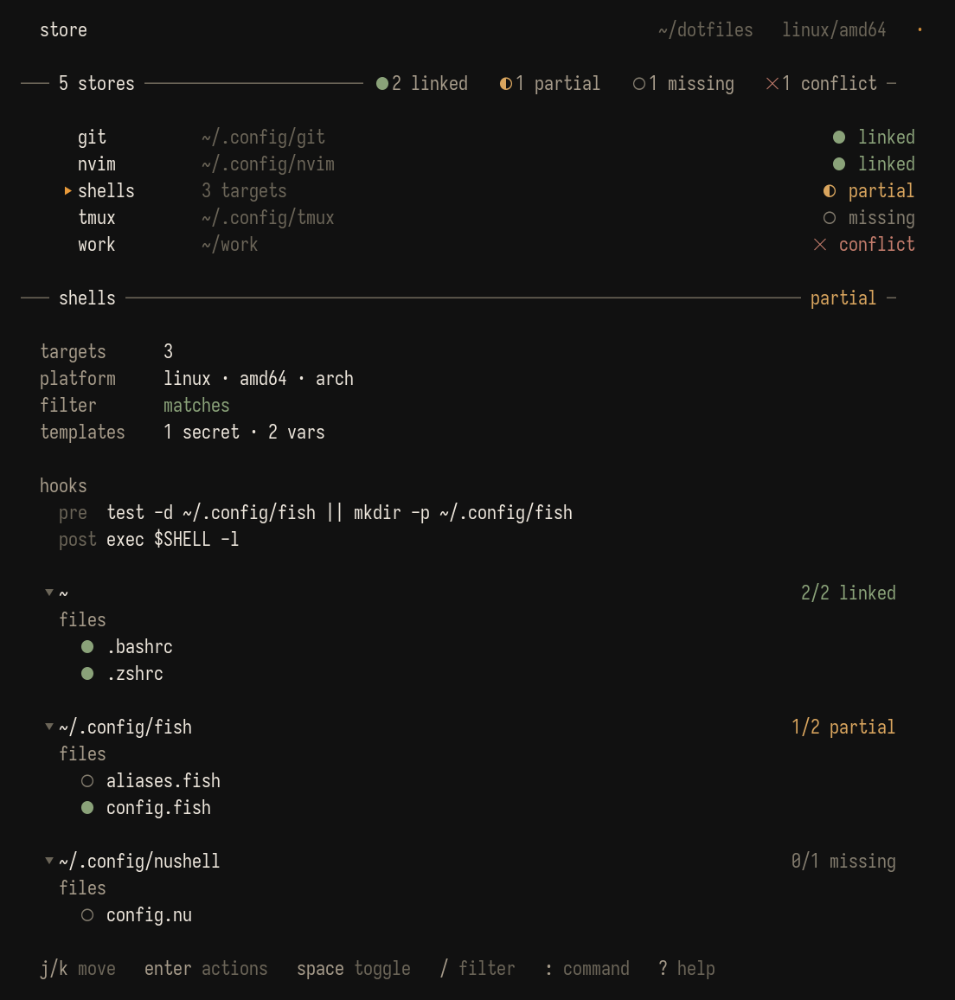

[](https://github.com/cushycush/store/actions/workflows/test.yml)
[](https://github.com/cushycush/store/releases)
[](https://aur.archlinux.org/packages/store-bin)
[](https://pkg.go.dev/github.com/cushycush/store/v2)
[](LICENSE)

`store` is a dotfile manager for Linux, macOS, and Windows. You keep your config files in one git repo; `store` reads a single YAML file and creates the symlinks that place each file where the relevant program expects to find it — `~/.zshrc`, `~/.config/nvim`, and so on. Unlike GNU Stow, your repo directory structure does not have to mirror your home directory — target paths are declared explicitly. One repo, one config file, one command per machine.

> Bare `store` is non-destructive — it prints help. `store apply` is the verb that reconciles symlinks. `store tui` opens an interactive dashboard.

> **Upgrading from 1.x?** See [MIGRATING.md](MIGRATING.md) — the only breaking change is that bare `store` now prints help instead of reconciling; run `store apply` to reconcile.

## Companion: stock

[`stock`](https://github.com/cushycush/stock) installs the packages, tools, and runtimes your dotfiles depend on. Same `.store/` directory, same `when:` platform filters, same hook env contract — declared in `.store/packages.yaml` instead of `config.yaml`. Pair metaphor: you stock a store with inventory.

Install `stock` via the same channels `store` uses (AUR, Nix, `go install`, prebuilt binaries) and then invoke it as either a standalone binary or through `store`'s git-style dispatch:

```sh
stock doctor            # direct
store stock doctor      # delegated by store if `stock` is on $PATH
```

`store`'s TUI header picks up a dim `stock` signpost when the binary is available.

## Table of Contents

- [Overview](#overview)
- [How It Compares](#how-it-compares)
- [Installation](#installation)
- [Quick Start](#quick-start)
- [Concepts](#concepts)
- [Config Format](#config-format)
- [Hooks](#hooks)
- [Templates & Secrets](#templates--secrets)
- [Platform Conditionals](#platform-conditionals)
- [Ignoring Files](#ignoring-files)
- [Internals](#internals)
- [Interactive TUI](#interactive-tui)
- [Commands](#commands)
- [Shell Completion](#shell-completion)
- [Status Indicators](#status-indicators)
- [Troubleshooting](#troubleshooting)

---

## Overview

Each store is a top-level directory in your repo. The config in `.store/config.yaml` tells `store` where that directory, or selected files inside it, should appear on disk.

Example repo layout:

```text
~/dotfiles/
  .store/config.yaml
  nvim/
    init.lua
    lua/
  shells/
    .zshrc
    .bashrc
    config.fish
    config.nu
  git/
    .gitconfig
```

Example result after running `store apply`:

```text
~/.config/nvim                -> ~/dotfiles/nvim
~/.zshrc                      -> ~/dotfiles/shells/.zshrc
~/.bashrc                     -> ~/dotfiles/shells/.bashrc
~/.config/fish/config.fish    -> ~/dotfiles/shells/config.fish
~/.config/nushell/config.nu   -> ~/dotfiles/shells/config.nu
~/.config/git                 -> ~/dotfiles/git
```

---

## How It Compares

### vs. GNU Stow

| Differentiator               | GNU Stow                                                | store                                                              |
| ---------------------------- | ------------------------------------------------------- | ------------------------------------------------------------------ |
| **Directory structure**      | Must mirror the target filesystem hierarchy             | Uses top-level store directories plus explicit config              |
| **Target paths**             | Inferred from package layout and invocation directory   | Declared explicitly per store or target in YAML                    |
| **Configuration**            | Convention-based                                        | Single `.store/config.yaml` file                                   |
| **Granularity**              | Primarily package/file symlinks based on layout         | Whole-directory mode or file-mode with `files`/`patterns`          |
| **Multiple targets**         | Usually split across separate packages                  | One store can deploy to multiple target paths                      |
| **Conflict handling**        | Stops and requires manual cleanup                       | Detects conflicts and can move existing files into the store       |
| **Setup on new machine**     | Run `stow` from the right place with the right packages | Run `store apply` anywhere inside the repo                         |
| **Secret management**        | No built-in encrypted secret store                      | Encrypted secrets plus `{{ secret "name" }}` templates             |
| **Platform conditionals**    | No built-in platform filters                            | `when:` supports OS, arch, distro, hostname, shell, and WSL        |
| **Ignore patterns**          | Manual exclusions or separate packages                  | Built-in global ignores plus per-store/per-target `ignore:`        |
| **Shell completion**         | Shell-specific setup outside the tool                   | `store completion` generates scripts for major shells              |
| **Health checks (doctor)**   | No built-in diagnostics command                         | `store doctor` checks config, targets, secrets, and platform skips |
| **Import existing symlinks** | No import command                                       | `store import` scans existing symlinks and writes config           |
| **Adopt existing files**     | Manual move-and-link workflow                           | `store adopt` moves files into the repo and symlinks back          |
| **Dry run preview**          | No built-in preview command                             | `store diff` shows create/replace/conflict actions before changes  |
| **Interactive UI**           | None                                                    | `store tui` — dashboard with a command palette                     |

### vs. chezmoi, dotbot, yadm

- **chezmoi.** Chezmoi renders every file through its template engine by default and keeps a shadow source directory; `store` renders only files that reference templates and never shadows — it creates plain symlinks from the target to your repo. If you want `git diff` in the repo to reflect exactly what's on disk, `store` is simpler. If you need deep per-host state that isn't committed, chezmoi handles that out of the box.
- **dotbot.** Dotbot reads an install YAML and creates links. `store` does too, with a few additions: explicit conflict handling, an `adopt` command that moves existing files into the repo, encrypted secrets, platform conditionals, and a health `doctor` pass. Existing dotbot users can usually get most of the way with `store import`.
- **yadm.** Yadm wraps git and treats `~` as the working tree. `store` keeps the repo separate and links into `~`. Choose yadm if you want `git status` over your home directory; choose `store` if you want a repo you can `cd` into without `~` surprises.

---

## Installation

### Arch Linux (AUR)

```sh
# Precompiled binary
$ yay -S store-bin

# Build from source
$ yay -S store

# Track latest development
$ yay -S store-git
```

### Nix (flake)

```sh
# run once
$ nix run github:cushycush/store -- --help

# install into your profile
$ nix profile install github:cushycush/store
```

The flake also exposes a dev shell with Go and gopls pinned to the versions CI uses:

```sh
$ nix develop github:cushycush/store
```

### Prebuilt binaries (Linux · macOS · Windows)

Download the archive for your OS and architecture from the [releases page](https://github.com/cushycush/store/releases) and drop `store` (or `store.exe`) onto your `PATH`.

### go install

```sh
$ go install github.com/cushycush/store/v2/cmd/store@latest
```

### Build from source

```sh
$ git clone https://github.com/cushycush/store.git
$ cd store
$ make build
$ mv store /usr/local/bin/
```

> Windows: creating symlinks requires either Developer Mode enabled in Settings → Privacy & Security → For developers, or running your terminal as Administrator. `store doctor` detects the missing capability and warns on first run. Alternatively, run `store` from WSL.

---

## Quick Start

1. Initialize a dotfiles repo:

```sh
$ mkdir ~/dotfiles
$ cd ~/dotfiles
$ git init
$ store init
```

2. Adopt an existing config directory (moves it into the repo and symlinks back):

```sh
$ store adopt ~/.config/nvim
```

   Or create a store manually and point it at a target:

```sh
$ store add nvim ~/.config/nvim
```

3. Add a file-level store for files that live in your home directory:

```sh
$ store add shells ~ -f .zshrc -f .bashrc
```

4. Add more targets to the same store:

```sh
$ store target add shells -t ~/.config/fish -f config.fish
$ store target add shells -t ~/.config/nushell -f config.nu
```

5. Commit the repo:

```sh
$ git add -A
$ git commit -m "add dotfiles"
$ git push
```

6. Restore everything on a new machine:

```sh
$ git clone https://github.com/you/dotfiles.git ~/dotfiles
$ cd ~/dotfiles
$ store apply
```

If target files already exist, `store apply` detects the conflict, offers to move those files into the repo, and then creates the symlinks.

**Windows example.** Adopt a VS Code settings directory and adopt a PowerShell profile file:

```powershell
> store adopt $env:APPDATA\Code\User
> store adopt $HOME\Documents\PowerShell\Microsoft.PowerShell_profile.ps1
```

**Optional.** Run `store tui` for an interactive dashboard — every CLI verb is accessible from inside it. See [Interactive TUI](#interactive-tui).

---

## Concepts

Six ideas to keep in mind before you read the command reference. The rest of the README — Config Format, Hooks, Secrets, Commands — assumes these.

- **Store.** A top-level directory in your repo (`nvim/`, `shells/`, `git/`). Each store is independently configured in `.store/config.yaml` and can be linked or removed on its own.

- **Target.** The path on disk where a store (or selected files from it) gets symlinked: `~/.config/nvim`, `~/.zshrc`, and so on. Targets are declared explicitly — `store` never guesses based on directory names.

- **Whole-directory mode vs file mode.** A store either links its directory as a single symlink or links selected files into a target directory.

  - No `files` and no `patterns` → whole-directory mode. Example: `nvim/` is linked as `~/.config/nvim`.
  - Any `files` or `patterns` → file mode. Example: `.zshrc` and `.bashrc` from `shells/` land individually inside `~` alongside non-dotfile content.
  - `files` and `patterns` can be used together; matches are combined and deduplicated.
  - `ignore` applies in both modes.
  - If whole-directory mode would include ignored content, `store` automatically promotes that target to file mode so ignored files never appear at the target.

- **Single-target vs multi-target.** Use `target:` when a store goes to one place. Use `targets:` when one store's files fan out to several locations — for example, `shells` with `.zshrc` landing in `~`, `config.fish` in `~/.config/fish`, and `config.nu` in `~/.config/nushell`. You can switch between the two forms at any time; `store target add` and `store target remove` migrate automatically.

- **The config is the source of truth.** `.store/config.yaml` fully describes the symlink state you want on a machine. Running `store apply` reconciles the filesystem to match — it creates missing links, replaces broken ones, and leaves correct ones alone. Changing the config and running `store apply` again is the entire update loop.

- **Conflict handling.** If a target path already exists as a real file or directory (not a `store`-managed symlink), `store` stops before linking and offers to move the existing content into the repo and then symlink back. Nothing gets overwritten silently.

---

## Config Format

Configuration lives in `.store/config.yaml`.

Top-level format:

```yaml
vars:
  editor: nvim

stores:
  nvim:
    target: "~/.config/nvim"
  shells:
    target: "~"
    files:
      - .zshrc
      - .bashrc
    ignore:
      - "*.bak"
    hooks:
      post: "printf 'shells linked\n'"
    when:
      os: linux
```

Multi-target format:

```yaml
stores:
  shells:
    targets:
      - target: "~"
        files:
          - .zshrc
          - .bashrc
      - target: "~/.config/fish"
        files:
          - config.fish
      - target: "~/.config/nushell"
        patterns:
          - "*.nu"
        ignore:
          - "*.bak"
```

Rules:

- A store may use either `target` or `targets`, not both.
- In multi-target mode, `files`, `patterns`, and `ignore` belong inside each `targets[]` entry.
- If a store entry has no target yet, it is valid config but nothing is linked.
- `vars` is a top-level map alongside `stores`; values are accessible in templates as `{{ .Vars.key }}`.

### Top-level store fields

| Field      | Required | Description                                      |
| ---------- | -------- | ------------------------------------------------ |
| `target`   | No       | Target path for a single-target store            |
| `files`    | No       | Explicit list of files to link individually      |
| `patterns` | No       | Glob patterns to match files; supports `**`      |
| `ignore`   | No       | Glob patterns to exclude from linking            |
| `hooks`    | No       | Per-store `pre` and `post` shell commands        |
| `when`     | No       | Platform filter for this store                   |
| `targets`  | No       | List of per-target entries for multi-target mode |

### Nested `targets[]` fields

| Field                | Required | Description                                         |
| -------------------- | -------- | --------------------------------------------------- |
| `targets[].target`   | Yes      | Target path for this target entry                   |
| `targets[].files`    | No       | Explicit files to link individually for this target |
| `targets[].patterns` | No       | Glob patterns to match files for this target        |
| `targets[].ignore`   | No       | Glob patterns to exclude for this target            |

### `hooks` fields

| Field        | Required | Description                                          |
| ------------ | -------- | ---------------------------------------------------- |
| `hooks.pre`  | No       | Command run before link or unlink work for the store |
| `hooks.post` | No       | Command run after link or unlink work for the store  |

### `when` fields

| Field                 | Required | Description                                                         |
| --------------------- | -------- | ------------------------------------------------------------------- |
| `when.os`             | No       | OS name such as `linux`, `darwin`, or `windows`                     |
| `when.arch`           | No       | CPU architecture such as `amd64` or `arm64`                         |
| `when.distro`         | No       | Distro or OS family such as `ubuntu`, `arch`, `macos`, or `windows` |
| `when.distro_version` | No       | Distro version string                                               |
| `when.hostname`       | No       | Hostname to match                                                   |
| `when.shell`          | No       | Current shell name such as `zsh`, `bash`, `fish`, or `nu`           |
| `when.wsl`            | No       | Whether the machine is running under WSL                            |

### Pattern syntax

| Pattern          | Matches                                          |
| ---------------- | ------------------------------------------------ |
| `.zsh*`          | `.zshrc`, `.zshenv`, and similar top-level files |
| `*.conf`         | Top-level `.conf` files                          |
| `**/*.conf`      | `.conf` files at any depth                       |
| `config/*.lua`   | `.lua` files directly inside `config/`           |
| `**/*.{lua,vim}` | `.lua` and `.vim` files recursively              |

### Target path rules

- `~` and `~/...` are supported on the CLI and in config.
- In YAML, every `~` path must be quoted, for example `target: "~"` or `target: "~/.config/nvim"`.
- Relative CLI target paths are resolved to absolute paths before being saved.

---

## Hooks

Hooks let you run shell commands around store operations. Use them for post-link reloads, cache rebuilds, or validation steps tied to a specific store or to the whole repo.

Per-store hook example:

```yaml
stores:
  tmux:
    target: "~/.config/tmux"
    hooks:
      post: "tmux source-file ~/.config/tmux/tmux.conf 2>/dev/null || true"
  nvim:
    target: "~/.config/nvim"
    hooks:
      pre: "nvim --headless -c 'checkhealth' -c 'qa' 2>/dev/null"
```

Global hook layout:

```text
.store/hooks/
  pre-store
  post-store
  pre-remove
  post-remove
```

How it works:

- Per-store hooks are configured in YAML and executed with `sh -c` on Linux and macOS, and with `cmd.exe /C` on Windows.
- Global hooks live in `.store/hooks/`. On Linux and macOS they must have the executable bit set and are run directly via their shebang.
- On Windows the executable bit is ignored; global hooks are dispatched by file extension: `.ps1` scripts run under PowerShell, `.cmd`/`.bat`/`.exe` run directly, and anything else is attempted via `sh` (works under Git Bash or WSL).
- `pre` hooks abort that store on failure.
- `post` hooks only warn on failure.
- `pre-store` and `pre-remove` abort the whole command on failure.
- Hooks receive `STORE_ROOT`, `STORE_ACTION`, and detected platform variables; per-store hooks also receive `STORE_NAME` and `STORE_TARGET`.

---

## Templates & Secrets

Files in a store can contain Go `text/template` expressions. When `store` links or restores a store, it renders these templates into a local staging directory and symlinks the rendered output. Files without template expressions are symlinked directly.

### Template functions

| Expression                 | Description                                            |
| -------------------------- | ------------------------------------------------------ |
| `{{ secret "name" }}`      | Looks up an encrypted secret by name                   |
| `{{ env "VAR" }}`          | Reads an environment variable                          |
| `{{ .Hostname }}`          | Current machine hostname                               |
| `{{ .OS }}`                | Operating system (`linux`, `darwin`, `windows`)         |
| `{{ .Arch }}`              | CPU architecture (`amd64`, `arm64`, etc.)              |
| `{{ .Distro }}`            | Distro or OS family (`ubuntu`, `arch`, `macos`, etc.)  |
| `{{ .Shell }}`             | Current shell name (`zsh`, `bash`, `fish`, etc.)       |
| `{{ .Vars.key }}`          | User-defined variable from config `vars:` map          |

### User-defined variables

The top-level `vars:` map in `.store/config.yaml` defines key-value pairs accessible as `{{ .Vars.key }}` in templates:

```yaml
vars:
  editor: nvim
  email: user@example.com

stores:
  git:
    target: "~/.config/git"
```

```text
[user]
    email = {{ .Vars.email }}
[core]
    editor = {{ .Vars.editor }}
```

### Secrets

A secret is an encrypted value stored in `.store/secrets.enc` and rendered using `{{ secret "name" }}`.

```text
[github]
    token = {{ secret "github_token" }}
```

```sh
$ store secret set github_token
$ store apply
```

How it works:

- `store` scans the selected store directories and only prompts for a passphrase if rendering is needed.
- Secrets are stored in `.store/secrets.enc`.
- Rendered files are written into a local staging directory under `$XDG_STATE_HOME/store/<repo-hash>/` or `~/.local/state/store/<repo-hash>/` if `XDG_STATE_HOME` is unset.
- Files without template expressions are symlinked directly; rendered files are symlinked from the staging directory.
- Encryption uses Argon2id for key derivation and XChaCha20-Poly1305 for authenticated encryption.
- If a referenced secret is missing, the render step fails and the store operation stops.
- The passphrase comes from `STORE_PASSPHRASE` or hidden interactive input.
- `.store/secrets.enc` is designed to be committed; the plaintext secrets are not.

---

## Platform Conditionals

Platform conditionals let one repo serve multiple machines without separate branches or manual edits.

Example:

```yaml
stores:
  linux-shell:
    target: "~"
    files:
      - .bashrc
    when:
      os: linux

  work-tools:
    target: "~/work"
    when:
      hostname: work-laptop

  wsl-tools:
    target: "~/.local/bin"
    when:
      wsl: true
```

How it works:

- `store` compares each populated `when:` field against detected platform info.
- All specified fields must match.
- Stores without `when:` always apply.
- Detected values include OS, arch, distro, distro version, hostname, shell, and WSL state.
- Commands that operate on the configured set, such as `store apply`, `store diff`, and `store status`, skip non-matching stores.
- `store doctor` reports skipped stores as informational issues so you can confirm the filter is doing what you expect.

---

## Ignoring Files

Ignore patterns exclude files or directories from linking. This is useful for editor backups, nested metadata, scratch files, or partial stores that should not be exposed at the target.

Example:

```yaml
stores:
  nvim:
    target: "~/.config/nvim"
    ignore:
      - "*.bak"
      - "scratch/"
      - "**/*.test.lua"
```

How it works:

- Global ignore patterns are always active: `.store`, `.store/**`, `.git`, `.git/**`, `.gitignore`, `.DS_Store`.
- User-defined `ignore:` patterns are added on top of the global ignore set.
- Directory ignore patterns such as `scratch/` exclude the whole directory tree.
- Ignore matching uses the same glob engine as `patterns:`.
- If a target has `ignore:` or if the store contains globally ignored files, whole-directory mode is automatically promoted to file mode so ignored content never appears at the target.
- `ignore:` may be defined at the top level for single-target stores or inside each `targets[]` entry for multi-target stores.

---

## Internals

Implementation details a user might bump into at the edges. You don't need this to use `store`; it's here so the edges are documented.

- **Root discovery.** Commands can run from any subdirectory inside the repo; `store` walks upward until it finds `.store/`.
- **Portable target storage.** CLI target paths keep `~` prefixes when possible so config stays portable across machines.
- **Absolute symlinks.** Link targets are resolved to absolute source paths so the working directory does not matter.
- **Conflict resolution.** Before linking, `store` detects files or directories already occupying the target and offers to move them into the repo. If files already exist in the store where moved content would land, `store` lists the `.bak` backups it would create.
- **Whole-directory vs file mode.** No `files` or `patterns` means whole-directory mode unless ignored content forces promotion to file mode.
- **Template staging.** Secret-backed templates are rendered into a machine-local staging directory and linked from there.
- **Performance.** Explicit files use direct stat checks, non-recursive globs avoid full walks, and only `**` patterns trigger recursive traversal.

---

## Interactive TUI

`store tui` opens a keyboard-driven dashboard. Every CLI verb is reachable from inside it — a handful via single-letter bindings, the rest through the `:` command palette. The dashboard reads as a single vertical column: a ledger of your stores on top, the selected store's detail below, and the recent activity log beneath that. No panes, no outer frame.

```text
  store                                        ~/dotfiles   linux/amd64  ·

  ─── 4 stores ·  3 linked  1 missing ─────────────────────────────────

     nvim      ~/.config/nvim                             ●  linked
     shells    3 targets                                  ◐  partial
     git       ~/.config/git                              ●  linked
  ▸  tmux      ~/.config/tmux                             ○  missing

  ─── tmux ──────────────────────────────────────────────── missing ─

    target     ~/.config/tmux
    mode       whole directory

    files
      ○  tmux.conf
      ○  plugins/tpm

  ─── recent ─────────────────────────────────────────────────────────

    recent   ✓  refreshed                                          2s

  j/k move   enter actions   space toggle   / filter   : command   ? help
```

### Keymap

**Navigate**

| Key | Action |
| --- | ------ |
| `j` / `k` | Move up / down the store list |
| `g` / `G` | Top / bottom |
| `esc` / `h` | Back · close the top overlay |

**Stores**

| Key | Action |
| --- | ------ |
| `enter` | Open the action menu for the selected store |
| `space` | Quick toggle: link if missing, unlink if linked |
| `d` | Diff — preview to the activity log |
| `A` | Apply all (reconcile every store) |
| `R` | Remove the selected store (typed confirmation required) |
| `/` | Filter the store list live |

**Commands**

| Key | Action |
| --- | ------ |
| `:` | Open the command palette |
| `\` | Toggle full-screen activity log |
| `r` | Refresh from disk |
| `?` | Show this keymap inside the TUI |
| `q` / `ctrl+c` | Quit |

### Command palette

Press `:` anywhere to open a fuzzy-match palette over every CLI verb: `apply`, `init`, `import`, `adopt`, `add`, `modify`, `remove`, `remove --all`, `list`, `path`, `rename`, `edit`, `status`, `diff`, `doctor`, `version`, `target {add,remove,modify}`, `secret {set,get,remove,list}`. Pick an entry with `enter`; the palette prompts inline for any required arguments.

### Destructive actions

`remove <name>` and `remove --all` require typing the store's name (or the literal phrase `remove all`) to confirm. Single-store link/unlink is one keystroke; anything broader gates behind a typed confirmation. The safety floor rises with blast radius.

### Multi-target stores

A multi-target store's detail section shows each target as its own collapsible sub-rule with a per-target link count (`3/3 linked`). `space` expands or collapses the focused target. Each target can be linked, unlinked, or modified individually through the action menu's `target…` entry.

### Detail summary

The detail pane shows target, mode, platform, `when:` match status, configured hooks, and — when the store contains template files — a `templates` row summarising how many distinct secrets and `vars` keys are referenced. Counts are cached per store and refreshed on `r`.

### Activity log

Every operation writes an entry to the activity log. The main view shows the latest entry on a single line; press `\` for a full-screen view with scroll (`j`/`k`). The log is a 200-entry ring buffer — older entries fall off as new ones arrive.

---

## Commands

Reference for every subcommand. For a task-oriented tour, see [Quick Start](#quick-start) and [Concepts](#concepts). Run `store --help` for the live CLI tree.

Jump to: [apply](#store-apply) · [init](#store-init) · [import](#store-import) · [adopt](#store-adopt-path) · [add](#store-add-name-target) · [modify](#store-modify-name) · [list](#store-list) · [path](#store-path-name) · [rename](#store-rename-old-new) · [edit](#store-edit) · [target add](#store-target-add-name-target) · [target remove](#store-target-remove-name-target) · [target modify](#store-target-modify-name-target) · [remove](#store-remove-name) · [status](#store-status-name) · [diff](#store-diff) · [doctor](#store-doctor) · [tui](#store-tui) · [version](#store-version) · [secret set](#store-secret-set-name-value) · [secret get](#store-secret-get-name) · [secret remove](#store-secret-remove-name) · [secret list](#store-secret-list) · [completion](#store-completion-bashzshfishpowershell)

### `store apply`

Reconciles all configured stores: creates missing symlinks, replaces broken ones, and reports conflicts. Run this after cloning a dotfiles repo on a new machine or after editing `.store/config.yaml`. Running `store` with no arguments prints help; `store apply` is the explicit verb that performs the reconciliation.

| Flag        | Short | Description                                             |
| ----------- | ----- | ------------------------------------------------------- |
| `--only`    | `-o`  | Apply only the named stores (repeatable)                |
| `--dry-run` |       | Preview changes without applying (equivalent to `diff`) |
| `--force`   |       | Create `.bak` backups without prompting                 |

```sh
$ store apply -o nvim -o git
$ store apply --dry-run
$ store apply --force
```

```text
$ store apply
Storing all stores:
  nvim -> ~/.config/nvim
  shells -> ~ (files)
  shells -> ~/.config/fish (files)
  shells -> ~/.config/nushell (files)
```

How it works:

- Filters out stores whose `when:` clause does not match the current platform.
- Runs global `pre-store` and `post-store` hooks if present.
- Detects conflicts before linking and prompts once for all selected stores.
- Prompts for a secrets passphrase only if one of the selected stores needs template rendering.

### `store init`

Creates `.store/config.yaml` in the current directory.

```sh
$ store init
```

```text
Initialized store config at .store/config.yaml
```

Use this once at the root of a new dotfiles repo.

### `store import`

Scans for existing symlinks that already point into the repo and imports them into `.store/config.yaml`.

| Flag         | Description                                                                                      |
| ------------ | ------------------------------------------------------------------------------------------------ |
| `--scan-dir` | Directories to scan (repeatable). Defaults to `~`, `~/.config`, `~/.local/share`, `~/.local/bin` |
| `--dry-run`  | Print what would be imported without writing config                                              |

```sh
$ store import --dry-run
$ store import --scan-dir ~/.config --scan-dir ~/.local/bin
```

```text
$ store import --dry-run
Scanning for symlinks pointing into /home/user/dotfiles...

Found:
  nvim   ~/.config/nvim -> nvim/               (whole directory)
  shells ~/.zshrc -> shells/.zshrc             (file)
  shells ~/.bashrc -> shells/.bashrc           (file)

Dry run: would import 3 symlinks as 2 stores
```

How it works:

- Scans the immediate contents of each scan directory for symlinks.
- Keeps only links whose targets resolve inside the repo and point at a top-level store directory.
- Groups discovered links into single-target or multi-target store entries.
- Skips stores that already exist in config.
- Without `--dry-run`, `store import` prints the discovered mapping and asks for confirmation before writing config. The persistent `--force` flag skips that confirmation prompt.

### `store adopt <path>`

Takes an existing file or directory, moves it into the repo, creates a config entry, and symlinks back to the original location.

| Flag         | Short | Description                                                 |
| ------------ | ----- | ----------------------------------------------------------- |
| `--name`     | `-n`  | Override the derived store name                             |
| `--dry-run`  |       | Preview what would happen without making changes            |
| `--files`    | `-f`  | Only adopt specific files from a directory; repeatable      |
| `--patterns` | `-p`  | Only adopt files matching glob patterns; repeatable         |

```sh
$ store adopt ~/.config/nvim
$ store adopt ~/.zshrc
$ store adopt ~/.config/nvim --name vim
$ store adopt ~/.config/app -f config.toml -f settings.json
$ store adopt ~/.config/nvim --dry-run
```

```text
$ store adopt ~/.config/nvim
Adopting:
  ~/.config/nvim -> nvim/ (directory)
Proceed? [y/N] y
  nvim -> ~/.config/nvim
```

How it works:

- Directories are moved whole into the repo and symlinked back.
- Single files are placed into a store directory named after the file (leading dots stripped), with the target set to the file's parent directory.
- The store name is derived from the path basename. Use `--name` to override.
- `--files` and `--patterns` adopt only matching files from a directory, creating a file-mode store entry.
- Rejects paths that are already symlinks — use `store import` for those.

### `store add <name> [target]`

Creates a store directory if needed, adds the config entry, and immediately links it if a target is provided. The target path may be passed positionally or via `-t`/`--target`.

| Flag         | Short | Description                                             |
| ------------ | ----- | ------------------------------------------------------- |
| `--target`   | `-t`  | Target path (or pass positionally)                      |
| `--files`    | `-f`  | Explicit files to link individually; repeatable         |
| `--patterns` | `-p`  | Glob patterns to match files; repeatable; supports `**` |

```sh
$ store add nvim ~/.config/nvim
$ store add shells ~ -f .zshrc -f .bashrc
$ store add configs ~/.config -p "**/*.conf"
$ store add nvim -t ~/.config/nvim   # flag form still works
$ store add git                      # no target yet; linked later
```

How it works:

- Without a target, the store is saved but not linked yet.
- Without `--files` or `--patterns`, the entire store directory is linked.
- Relative targets are resolved to absolute paths before being saved.
- Passing both a positional target and `--target` is an error; pick one.

### `store modify <name>`

Updates an existing single-target store. Choose between wholesale replacement, incremental changes, or both.

| Flag               | Short | Description                                                |
| ------------------ | ----- | ---------------------------------------------------------- |
| `--target`         | `-t`  | Replace the target path                                    |
| `--files`          | `-f`  | Replace the file list; repeatable                          |
| `--patterns`       | `-p`  | Replace the pattern list; repeatable                       |
| `--add-file`       |       | Append a file to the file list; repeatable                 |
| `--remove-file`    |       | Remove a file from the file list; repeatable               |
| `--add-pattern`    |       | Append a pattern to the pattern list; repeatable           |
| `--remove-pattern` |       | Remove a pattern from the pattern list; repeatable         |
| `--clear-files`    |       | Remove all files from the entry                            |
| `--clear-patterns` |       | Remove all patterns from the entry                         |
| `--dry-run`        |       | Preview without applying changes                           |

```sh
$ store modify nvim -t ~/.config/nvim-custom
$ store modify shells --clear-files -p ".zsh*" -p ".bash*"
$ store modify shells --add-file .zprofile
$ store modify shells --remove-file .bashrc
```

How it works:

- Removes old symlinks before applying the updated config.
- Flags compose in this order: `--clear-*` → `--files`/`--patterns` → `--add-*` → `--remove-*`. This lets `--add-file` append to the existing list without replacing it, or to a replacement list supplied by `--files`.
- Re-links the store after saving the new entry.
- Refuses to run on multi-target stores; use `store target modify` instead.

### `store list`

Prints a one-line summary of every configured store without touching the filesystem. Useful for scripting or a quick glance.

```sh
$ store list
```

```text
  nvim → ~/.config/nvim
  shells (3 targets)
      ~
      ~/.config/fish
      ~/.config/nushell
  git → ~/.config/git
```

### `store path <name>`

Prints the absolute on-disk path of the store directory inside the repo. Designed for command substitution in shells.

```sh
$ cd $(store path nvim)
```

### `store rename <old> <new>`

Moves the store directory, updates the config entry, and re-links all targets under the new name.

```sh
$ store rename nvim vim
```

```text
Renamed store nvim → vim
```

### `store edit`

Opens `.store/config.yaml` in `$EDITOR` (falls back to `vi`). Does not validate on close — run `store doctor` afterwards to catch syntax or reference errors.

```sh
$ store edit
```

### `store target add <name> [target]`

Adds another target to an existing store. The target path may be passed positionally or via `-t`/`--target`.

| Flag         | Short | Description                                             |
| ------------ | ----- | ------------------------------------------------------- |
| `--target`   | `-t`  | Target path (or pass positionally)                      |
| `--files`    | `-f`  | Explicit files to link individually; repeatable         |
| `--patterns` | `-p`  | Glob patterns to match files; repeatable; supports `**` |
| `--dry-run`  |       | Preview without applying changes                        |

```sh
$ store target add shells ~/.config/fish -f config.fish
$ store target add shells -t ~/.config/nushell -p "*.nu"
```

How it works:

- Automatically migrates a single-target store to the `targets:` format.
- Rejects duplicate target paths after normalizing `~` and absolute paths.
- Passing both a positional target and `--target` is an error; pick one.

### `store target remove <name> [target]`

Removes one target from a store and unlinks that target's symlinks.

| Flag        | Short | Description                        |
| ----------- | ----- | ---------------------------------- |
| `--target`  | `-t`  | Target path (or pass positionally) |
| `--dry-run` |       | Preview without applying changes   |

```sh
$ store target remove shells ~/.config/fish
```

```text
removed target ~/.config/fish from shells
```

How it works:

- Finds the target by normalized path.
- Unlinks that target.
- Migrates the store back to single-target format automatically if one target remains.

### `store target modify <name> [target]`

Updates the `files` or `patterns` for one target inside a multi-target store. Supports the same wholesale and incremental flags as `store modify`.

| Flag               | Short | Description                                                |
| ------------------ | ----- | ---------------------------------------------------------- |
| `--target`         | `-t`  | Target path (or pass positionally)                         |
| `--files`          | `-f`  | Replace the file list; repeatable                          |
| `--patterns`       | `-p`  | Replace the pattern list; repeatable                       |
| `--add-file`       |       | Append a file to the file list; repeatable                 |
| `--remove-file`    |       | Remove a file from the file list; repeatable               |
| `--add-pattern`    |       | Append a pattern to the pattern list; repeatable           |
| `--remove-pattern` |       | Remove a pattern from the pattern list; repeatable         |
| `--clear-files`    |       | Remove all files from the target                           |
| `--clear-patterns` |       | Remove all patterns from the target                        |
| `--dry-run`        |       | Preview without applying changes                           |

```sh
$ store target modify shells ~ -f .zshrc -f .bashrc -f .zprofile
$ store target modify shells ~ --add-file .zprofile
$ store target modify shells ~/.config/nushell --clear-files -p "*.nu"
```

How it works:

- Removes old symlinks for the selected target first.
- Flag composition is the same as `store modify`: `--clear-*` → replace → add → remove.
- Re-links only the updated target after saving config.

### `store remove [name]`

Removes the store's symlinked targets and deletes the store entry from config. With `--all`, removes every configured store.

| Flag        | Description                                     |
| ----------- | ----------------------------------------------- |
| `--all`     | Remove every configured store                   |
| `--yes`     | Skip the confirmation prompt when using `--all` |
| `--dry-run` | Preview without applying changes                |

```sh
$ store remove nvim
$ store remove nvim --dry-run
$ store remove --all
$ store remove --all --yes
```

```text
$ store remove nvim
Removed store nvim (~/.config/nvim)
```

```text
$ store remove --all
Remove ALL configured stores? [y/N] y
Removing all stores:
  removed nvim (~/.config/nvim)
  removed git (~/.config/git)
```

How it works:

- With a name, removes that one store's symlinks and config entry. The directory inside your repo is left untouched.
- With `--all`, prompts for y/N unless `--yes` is passed, then runs global `pre-remove` and `post-remove` hooks and removes every store. Continues removing other stores even if one fails, then reports aggregated errors.
- `store removeall` is a deprecated alias for `store remove --all --yes` and prints a deprecation warning. Use the new form.

### `store status [name]`

Shows the current symlink state for one store or all stores.

```sh
$ store status
$ store status nvim
```

```text
$ store status
  nvim                 [linked]   ~/.config/nvim
  shells               .zshrc               [linked]   ~/.zshrc
  shells               config.fish          [missing]  ~/.config/fish/config.fish
  git                  [conflict] ~/.config/git
```

How it works:

- In file mode, each linked file is reported separately.
- When run without a name, stores filtered out by `when:` are omitted.

### `store diff`

Previews what `store apply` would do without changing anything.

| Flag     | Short | Description                                |
| -------- | ----- | ------------------------------------------ |
| `--only` | `-o`  | Preview only the named stores (repeatable) |

```sh
$ store diff
$ store diff --only nvim --only git
```

```text
$ store diff
  nvim   ~/.config/nvim                     [ok]
  shells .zshrc → ~/.zshrc                 [ok]
  shells config.fish → ~/.config/fish/config.fish [create]
  git    ~/.config/git                     [conflict]

Summary: 2 ok, 1 to create, 1 conflict, 0 to replace
```

How it works:

- Uses the same platform filtering as `store apply`.
- Reports current targets as `ok`, `create`, `conflict`, `replace`, or `error`.
- `replace` means a broken symlink would be removed and recreated.

### `store doctor`

Runs diagnostics against the current repo and reports errors, warnings, and informational issues.

```sh
$ store doctor
```

```text
Checking store health...

  [ok] 4 stores configured
  [ok] all symlinks healthy

  [info] directory "scratch" exists but is not configured as a store
  [warn] secrets file not found but templates reference secrets

2 issues found (1 warning, 1 info)
```

What it checks:

- Config entries whose store directory is missing.
- Top-level directories in the repo that are not configured as stores.
- Broken symlinks.
- Multiple stores claiming the same target path.
- Missing secrets file or missing referenced secrets when `STORE_PASSPHRASE` is available.
- Empty store directories.
- Stores skipped on the current platform because of `when:`.

How it works:

- Exits with a non-zero code only when doctor-level errors are found.
- Warnings and info are still printed but do not make the command fail.

### `store tui`

Opens the interactive dashboard. See [Interactive TUI](#interactive-tui) for the full keymap, command palette, and destructive-action conventions.

```sh
$ store tui
```

### `store version`

Prints the current version.

```sh
$ store version
$ store --version
```

```text
store version <version>
```

If built without an injected version, the binary reports `dev`.

### `store secret set <name> [value]`

Creates or updates one encrypted secret.

```sh
$ store secret set github_token
$ store secret set api_key "super-secret"
```

How it works:

- If `value` is omitted, `store` prompts for it with hidden input. This is the recommended form; passing the value as an argument exposes it to shell history and process listings, and `store` prints a warning when you do.
- Reads the passphrase from `STORE_PASSPHRASE` or prompts interactively.

### `store secret get <name>`

Prints one decrypted secret value.

```sh
$ store secret get github_token
```

### `store secret remove <name>`

Deletes one secret from `.store/secrets.enc`. Aliased as `store secret rm`.

```sh
$ store secret remove github_token
$ store secret rm github_token
```

### `store secret list`

Lists secret names in sorted order.

```sh
$ store secret list
```

How it works (all secret commands):

- Secrets are stored in `.store/secrets.enc`.
- Secret names are listed; secret values are never listed.
- See [Secrets](#secrets) for template rendering details.

### `store completion [bash|zsh|fish|powershell]`

Generates a shell completion script. See [Shell Completion](#shell-completion) for install steps.

---

## Shell Completion

`store completion` generates completion scripts for supported shells. This is the easiest way to make the command and store-name arguments discoverable from the terminal.

### Bash

```sh
$ mkdir -p ~/.local/share/bash-completion/completions
$ store completion bash > ~/.local/share/bash-completion/completions/store
```

### Zsh

```sh
$ store completion zsh > "${fpath[1]}/_store"
```

### Fish

```sh
$ mkdir -p ~/.config/fish/completions
$ store completion fish > ~/.config/fish/completions/store.fish
```

### PowerShell

```sh
$ store completion powershell | Out-String | Invoke-Expression
```

How it works:

- The CLI generates shell-native completion scripts through Cobra.
- Existing store names are offered as tab completions for commands that take a configured store name, such as `modify`, `remove`, `status`, and `target` subcommands.
- If your shell requires an explicit completion system bootstrap, enable that in the shell separately.
- Regenerate the script after upgrading `store` if you want completion descriptions and command trees to stay current.

---

## Status Indicators

| Status       | Meaning                                                          |
| ------------ | ---------------------------------------------------------------- |
| `[linked]`   | A symlink exists and points to the expected source               |
| `[missing]`  | No symlink exists yet                                            |
| `[conflict]` | A non-store file or directory exists where `store` wants to link |
| `[broken]`   | A symlink exists but points to a missing source                  |
| `[drift]`    | A rendered file exists at the target but its content has changed |

These statuses appear in `store status`, and the same underlying states drive `store diff`. `store status` also prints a summary line showing the count of each status across all reported stores.

---

## Troubleshooting

### `target: ~` does not work in YAML

Bare `~` is YAML null, not a string. Quote every `~` path:

```yaml
stores:
  shell:
    target: "~"
```

The same rule applies to paths such as `"~/.config/nvim"`.

### `store` says there is no `.store` directory

Run the command inside a repo initialized with `store init`, or initialize the current directory first.

### Existing files already occupy the target path

`store apply` reports conflicts before linking and offers to move those files into the store.

```text
The following files conflict with store symlinks:
  ~/.config/nvim (directory -> will be moved to ~/dotfiles/nvim)
  ~/.zshrc (file -> will be moved to ~/dotfiles/shells/.zshrc)

Move these files into the store and create symlinks? [y/N]
```

If files already exist inside the store where moved content would land, `store` asks before creating `.bak` backups. Use `--force` to skip that backup confirmation.

### `store diff` shows `replace`

`replace` means the target is currently a broken symlink. Running `store apply` will remove it and recreate it correctly.

### `store doctor` warns about secrets

If templates reference secrets and `.store/secrets.enc` is missing, doctor warns immediately. If the secrets file exists, set `STORE_PASSPHRASE` before running `store doctor` if you want it to verify that referenced secret names are actually present.

### `store apply` failed part way through

`store apply` is idempotent — re-running it picks up where it left off. To narrow down what went wrong:

- `store status` shows what's linked and what isn't.
- `store diff` shows what `apply` would still change.
- `store apply --only <name>` runs one store in isolation so the error is easier to read.
- `store doctor` surfaces configuration problems that may be causing the failure.

### Windows: `store` can't create symlinks

Creating symlinks on Windows requires either Developer Mode enabled (Settings → Privacy & Security → For developers) or running the terminal as Administrator. `store doctor` detects the missing capability on first run. Alternatively, run `store` from WSL, which has no such restriction.

### A store is skipped on a machine where I expect it to apply

`when:` filters compare against detected platform info. If a store isn't matching:

1. Run `store doctor` — it reports skipped stores as informational issues and shows which field didn't match.
2. Common causes: distro name doesn't match what you expect (e.g. `debian` vs `raspbian`), WSL detection on an unusual setup, or a hostname that changed.
3. To inspect the detected values, write a quick hook that echoes them — per-store hooks receive `STORE_OS`, `STORE_ARCH`, `STORE_DISTRO`, `STORE_DISTRO_VERSION`, `STORE_HOSTNAME`, `STORE_SHELL`, and `STORE_WSL` in the environment.

### `STORE_PASSPHRASE` in scripts and CI

Set `STORE_PASSPHRASE` in the environment before running `store apply` or `store doctor` to avoid interactive prompts. With the variable set, `store doctor` additionally verifies every referenced secret is present in the vault. An unset or wrong passphrase causes template rendering to fail loudly — no silent fall-through, no stale output.

### Fast navigation with `store path`

`store path <name>` prints the absolute on-disk path of a store and nothing else — no ANSI, no log output. That makes it safe for command substitution inside aliases and pipelines:

```sh
$ cd $(store path nvim)
$ ls -la $(store path shells)
```
